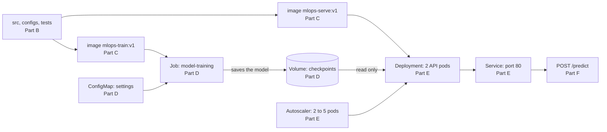

# mlops-pytorch-pipeline

This project trains an image classifier using PyTorch and serves it through a
web API. An image can be sent to the API, and it returns the predicted class.

The project runs on a normal laptop CPU. A GPU is not required.

The dataset is Fashion-MNIST. It contains 70,000 grey images of clothing
items, sized 28 by 28, divided into 10 classes such as T-shirt, Trouser,
Sneaker and Bag.

The work is done in parts, and each part adds to the same project. The
sections below follow that order.

---

## Architecture

The same code becomes two images. The Job trains the model using the settings
from the ConfigMap and saves it to a volume. The two API pods mount that
volume as read only, and requests reach them through the Service.

## Which part each file belongs to

    Part A   .gitignore, .github/workflows/ci.yml, the folder structure
    Part B   src/, configs/, requirements/, tests/, scripts/
    Part C   docker/Dockerfile.train, docker/Dockerfile.serve, .dockerignore
    Part D   k8s/namespace.yaml, k8s/configmap.yaml, k8s/storage.yaml,
             k8s/training-job.yaml
    Part E   k8s/serving-deployment.yaml, k8s/serving-service.yaml,
             k8s/hpa.yaml, k8s/secret.example.yaml
    Part F   the end to end run in the last section of this file

# Part A: Repository setup

This part creates the folder structure, the ignore rules and the CI workflow.

## The folders

    .github/workflows/ci.yml       runs the linter, the tests and the builds
    configs/training_config.yaml   all the settings
    src/                           model.py, dataset.py, train.py, serve.py
    docker/                        Dockerfile.train and Dockerfile.serve
    k8s/                           the Kubernetes files
    requirements/                  train.txt, serve.txt and dev.txt
    scripts/                       helper scripts
    tests/                         the tests

## The branches

Work is done on feature branches, which are merged into develop through pull
requests, and develop is merged into main at the end.

    git branch -a
    git log --oneline --graph --all
---

# Part B: Model, training and the API

This part adds the model, the training script and the web API.

## Step 1: Create a virtual environment

A virtual environment keeps the packages for this project separate from the
rest of the system.

On Windows PowerShell:

    python -m venv .venv
    .venv\Scripts\activate

On Mac or Linux:

    python -m venv .venv
    source .venv/bin/activate

Once it is active, the prompt shows (.venv) at the beginning.

## Step 2: Install the packages

    pip install -r requirements/dev.txt

The first install takes a few minutes because PyTorch is a large download.

## Step 3: Run the tests

    pytest tests -v
    ruff check src tests scripts

The tests check the model output shapes, saving and loading a model file, the
handling of uploaded images, the settings file and the API. They all pass in
under a minute.

## Step 4: Short training run

This run uses 2 epochs and 15 percent of the data, and finishes in under a
minute. It is a quick check that the training loop works.

On Windows PowerShell:

    $env:EPOCHS="2"
    $env:SUBSET_FRACTION="0.15"
    python src\train.py

On Mac or Linux:

    EPOCHS=2 SUBSET_FRACTION=0.15 python src/train.py

On the first run the dataset is downloaded into a folder named data. This is
about 30 MB, and later runs reuse the same copy.

## Step 5: Full training run

On Windows the settings from Step 4 stay active for the rest of the terminal
session, so they must be cleared first.

    Remove-Item Env:EPOCHS, Env:SUBSET_FRACTION
    $env:TORCH_NUM_THREADS="8"
    python src\train.py

On Mac or Linux, open a new terminal or run:

    TORCH_NUM_THREADS=8 python src/train.py

The full run takes about 10 to 15 minutes on 8 CPU cores and reaches around
91 percent accuracy.

Each epoch prints one line:

    {"event": "epoch_completed", "epoch": 6, "train_loss": 0.2351,
     "train_accuracy": 0.9162, "val_loss": 0.2295, "val_accuracy": 0.9155,
     "duration_seconds": 68.4}

The values mean the following:

- epoch is the number of the training round
- train_accuracy is the score on the images used for training
- val_accuracy is the score on images the model has not seen, so this is the
  more useful number
- val_loss decreasing means the model is still improving

The model is saved to checkpoints/classifier_v1.pt, but only when val_loss
improves. If there is no improvement for 3 epochs in a row, training stops
early and an early_stopping line is printed.

## Step 6: Start the API

This terminal must stay open while the API is running.

    $env:MODEL_PATH=".\checkpoints\classifier_v1.pt"
    python src\serve.py

The API starts on port 8080. If another program is already using that port,
choose a different one with $env:PORT and pass the same one to the test script
in the next step.

## Step 7: Test the API

Open a second terminal, activate the virtual environment again, then run:

    python scripts\make_test_image.py --from-dataset
    python scripts\smoke_test.py

The first command saves a real image from the dataset as test_image.png and
prints its actual class. The second command calls all three endpoints and
prints the responses. The predicted class should match the actual class.

The address http://localhost:8080/docs also opens a page in the browser where
an image can be uploaded and the result viewed directly.

## The endpoints

- /health reports whether the model is loaded. It returns 200 when the model
  is ready and 503 when it is not.
- /metadata reports which model is loaded, which dataset it was trained on and
  the accuracy it reached.
- /predict accepts an uploaded image and returns the predicted class along
  with a score for all 10 classes.

---

# Part C: Docker images

This part packages the training script and the API into two images.

Docker Desktop must be running before any of these commands.

## Step 8: Build and run the training image

    docker build -f docker/Dockerfile.train -t mlops-train:v1 .

The first build takes several minutes, because PyTorch is downloaded inside
the image.

    docker run --rm -e EPOCHS=2 -e SUBSET_FRACTION=0.15 -v ${PWD}/data:/app/data -v ${PWD}/checkpoints:/app/checkpoints mlops-train:v1

The two mounted folders keep the images and the trained model on the laptop
instead of inside the container, so nothing is lost when the container stops,
and the dataset is not downloaded again.

Leave out the two environment variables for a full run.

## Step 9: Build and run the serving image

    docker build -f docker/Dockerfile.serve -t mlops-serve:v1 .

    docker run --rm -p 8080:8080 -v ${PWD}/checkpoints:/app/checkpoints mlops-serve:v1

Then test it from a second terminal, the same way as in Step 7:

    python scripts\smoke_test.py

On Mac or Linux, replace ${PWD} with $(pwd).

## Step 10: Check the images

The container reports itself as healthy after about 20 seconds:

    docker ps

The STATUS column shows healthy once Docker has called /health inside the
container and received a 200. This comes from the HEALTHCHECK line in
Dockerfile.serve.

The sizes can be listed with:

    docker image ls --filter "reference=mlops-*"

Both images are around 1.5 GB on disk and about 315 MB compressed. PyTorch is
most of that, and both images need it, so their sizes are close.

The packages installed in each image can be compared:

    docker run --rm --entrypoint pip mlops-train:v1 list
    docker run --rm mlops-serve:v1 pip list

The training image needs --entrypoint pip because its entrypoint is set to run
the training script.

The serving image does not contain the training script at all:

    docker run --rm mlops-serve:v1 ls src/

This prints dataset.py, model.py and serve.py only, because Dockerfile.serve
copies those three files by name instead of the whole folder.

## How the images are built

Both use more than one stage. The first stage installs the packages into a
virtual environment, and only that environment is copied into the final image,
so the compiler and the download cache are left behind.

The training image copies the src and configs folders, creates the folders for
the data and the saved model, and runs as a user other than root. CONFIG_PATH
points at the settings file, so a different file can be mounted over it
without rebuilding the image.

The serving image installs from requirements/serve.txt, which has no packages
that are only used for training. It runs as a user other than root, opens port
8080, and has a HEALTHCHECK that calls /health using Python rather than curl,
so no extra package has to be installed.

All the versions in requirements/train.txt and requirements/serve.txt are
pinned, so the same image is produced each time it is built.

---

# Part D: Kubernetes training job

This part runs the training script on a Kubernetes cluster as a Job. The
cluster used here is the one built into Docker Desktop, which must be turned
on in Settings, under Kubernetes.

Check the cluster is reachable:

    kubectl get nodes

Both images from Part C must be built already. Docker Desktop shares its
images with its own cluster, so nothing needs to be pushed anywhere. If a pod
later reports ErrImagePull, load the images by hand:

    kind load docker-image mlops-train:v1 --name desktop
    kind load docker-image mlops-serve:v1 --name desktop

## Step 11: Create the namespace, the settings and the storage

    kubectl apply -f k8s/namespace.yaml
    kubectl apply -f k8s/configmap.yaml
    kubectl apply -f k8s/storage.yaml

    kubectl get all -n ml-training
    kubectl get pvc -n ml-training

The settings file is now held in the cluster as a ConfigMap rather than inside
the image, so a value can be changed without rebuilding anything:

    kubectl describe configmap training-config -n ml-training

## Step 12: Run the training job

    kubectl apply -f k8s/training-job.yaml

    kubectl get jobs -n ml-training
    kubectl get pods -n ml-training
    kubectl logs -f job/model-training -n ml-training

The same JSON lines appear as when training ran on the laptop. The job mounts
the settings from the ConfigMap at /app/configs, and two volumes for the
images and the saved model, so the model survives after the pod is gone.

Wait for the job to finish before going on:

    kubectl wait --for=condition=complete job/model-training -n ml-training --timeout=30m

---

# Part E: Kubernetes model serving

This part runs the API in the cluster, behind a Service, with an autoscaler.

## Step 13: Start the API

    kubectl create secret generic serving-secrets --from-literal=API_TOKEN=local-token -n ml-training

    kubectl apply -f k8s/serving-deployment.yaml
    kubectl apply -f k8s/serving-service.yaml

    kubectl get pods -n ml-training
    kubectl describe deployment model-serving -n ml-training

Two pods are started. Each one waits until /health returns 200 before it is
sent any requests, which is the readiness probe doing its job. The pods mount
the saved model as read only, since the API never writes to it.

## Step 14: Add the autoscaler

The autoscaler needs metrics-server, which is not installed by default:

    kubectl apply -f https://github.com/kubernetes-sigs/metrics-server/releases/latest/download/components.yaml
    kubectl patch deployment metrics-server -n kube-system --type=json -p="[{\"op\":\"add\",\"path\":\"/spec/template/spec/containers/0/args/-\",\"value\":\"--kubelet-insecure-tls\"}]"

Then:

    kubectl apply -f k8s/hpa.yaml
    kubectl get hpa -n ml-training

The TARGETS column shows a percentage once metrics-server has collected
figures, which takes about a minute.

---

# Part F: End to end check

Everything applied in order, then a prediction requested through the Service.

## Step 15: Test the API in the cluster

    kubectl port-forward svc/model-serving 8080:80 -n ml-training

Then from a second terminal:

    python scripts\smoke_test.py

The service listens on port 80 and passes requests to port 8080 in the
container, and port-forward connects the laptop to it.

## Cleaning up

    kubectl delete namespace ml-training

If the training pod stays Pending, the cluster does not have 2 CPUs and 4 GB
free. Either give Docker Desktop more resources in Settings, or lower the
requests in k8s/training-job.yaml.

---

# Settings

All settings are in configs/training_config.yaml, including epochs,
batch_size and learning_rate.

For a temporary change, an environment variable can be used instead of editing
the file:

    EPOCHS              number of training rounds
    SUBSET_FRACTION     portion of the data to use, where 1.0 means all of it
    DATA_DIR            location of the dataset
    CHECKPOINT_DIR      location where the trained model is saved

The paths in the settings file are relative, such as ./data. Docker uses /app
as its working directory, so ./data becomes /app/data inside a container. The
same settings file therefore works both on a laptop and in Kubernetes.